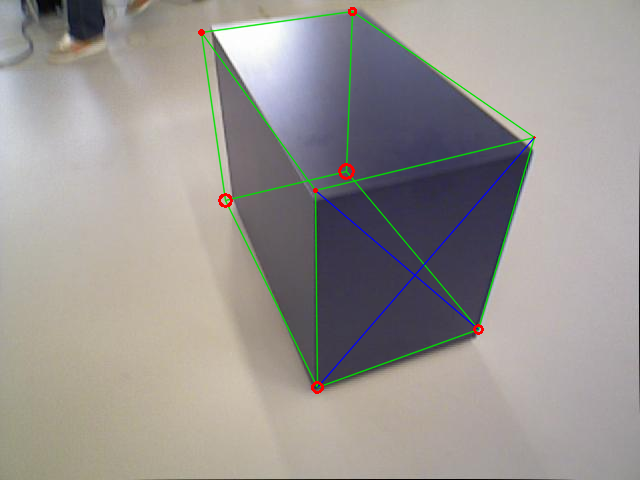
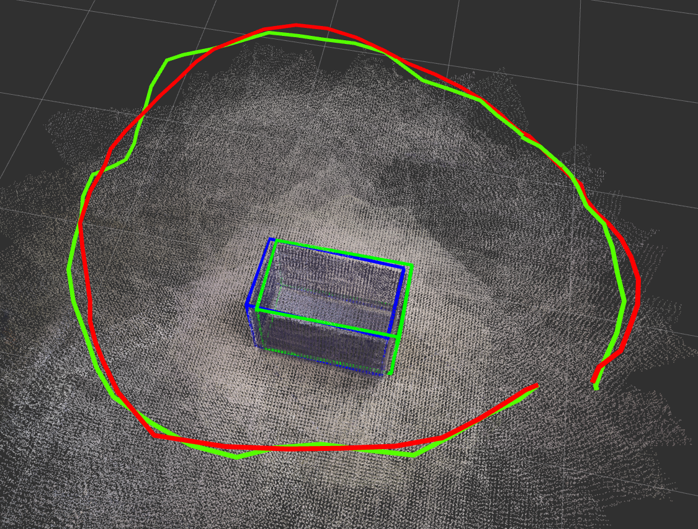

# 3d Object Estimation with Bounding Box Constraints
This project is about 3d object estimation from single image based on bounding box.

## this code is just for cabinet dataset

## directory
in folder /cmake_det_slam, we can find the cmake code to detect object and use object for SLAM  

in folder /ros_det_slam, we add visulazation for SLAM  

in folder /data, we save some neccessary images or files. 

## how to run the project
1) data folder should contain:  
-raw_imgs folder with images and rgb.txt  
-depth_imgs folder with images and depth.txt  
-bbox_2d_yolov2 folder with 2d bbox result and yolov3_bbox.txt  
-TUM3.yaml # calibration  
-truth_cam_poses.txt # ground truth for camera
-truth_objects.txt # ground truth for object (measured from point cloud)  

2) to build essential thirdparty library  
cd cmake_det_slam/Thirdpary  
cd line_lbd  
mkdir build  
cd build  
cmake ..  
make  
>> it will output a library "libline_lbd_lib.so" in line_lbd/lib

cd cmake_det_slam/Thirdpary  
cd ticioc_profiler  
mkdir build  
cd build  
cmake ..  
make  
>> it will output a library "libtictoc_profiler.so" in ticioc_profiler/lib

3) to build and run cmake code:    
cd cmake_det_slam  
mkdir build  
cd build  
cmake ..  
make  
./bbox_cabinet_det_node ../../data #path_to_cabinet data
>> it can output "online_camera.txt" and "online_cube.txt" to save the result. 

4) to run ros code:  
firstly, you also need to build essential thirdparty library in (2)
secondly, you need to build g2o in thirdparty library
cd ros_det_slam/Thirdpary  
cd g2o  
mkdir build  
cd build  
cmake ..  
make  
>> it will output a library "libg2o.so" in g2o/lib

thridly, build and run visulazation code:  
cd ros_det_slam/src  
catkin_init_workspace  
cd ..  
catkin_make
source devel/setup.bash    
roslaunch object_slam_bbox object_slam_example.launch   

## more results
<figure class="video_container">
  <video controls="true" allowfullscreen="true" poster="pic/slam_livingroom.png">
    <source src="path/to/20210712_orb_bbox_living_room_5.mp4" type="video/mp4">
    <source src="path/to/20210712_orb_bbox_living_room_5.ogg" type="video/ogg">
    <source src="path/to/20210712_orb_bbox_living_room_5.webm" type="video/webm">
  </video>
</figure>

## Notes

* The code is released under the BSD license. Feel free to adjust it as you like for research. Please cite our paper in your publications if you feel it helpful. 

* The code referred to several open-source SLAM codes, thanks to their great work: [ORBSLAM](https://github.com/raulmur/ORB_SLAM2), [CubeSLAM](https://github.com/shichaoy/cube_slam). 

* If you have any further questions, feel free to contact the author: benchun.germany{at}gmail.com

